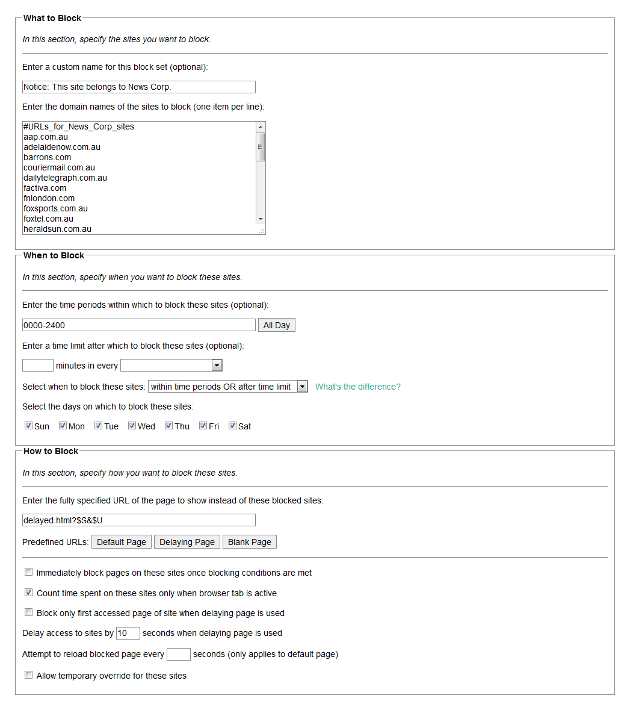

# leechblock-lists
## Block and delay lists for Leechblock

These are lists that I use for [LeechBlock](https://www.proginosko.com/leechblock/) because I keep forgetting what I've set across my machines.

---

Two of the lists are for the major news outlets News Corp and Nine/Fairfax, which dominate the Australian news space. I want to be more aware of which corporation's news I'm viewing, so I have created these URL lists that can be used to trigger a delaying page.

