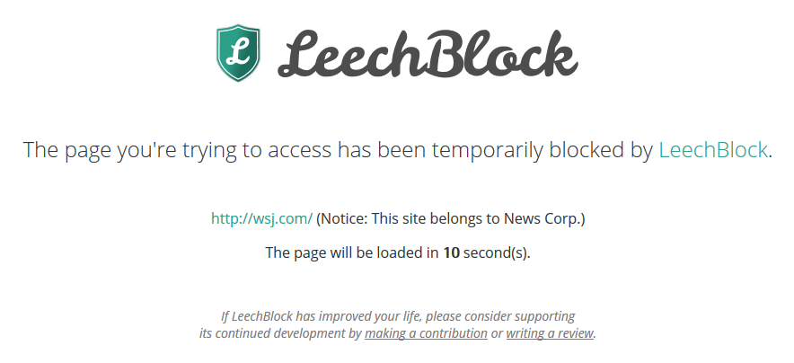

# leechblock-lists
## Block and delay lists for Leechblock

These are lists that I use for [LeechBlock](https://www.proginosko.com/leechblock/) because I keep forgetting what I've set across my machines.

---

Some of the lists are for the major news outlets, so far **News Corp**, **Nine/Fairfax**, and **DMG Media**.

I want to be more aware of which corporation's news I'm viewing, so I have created delays in [LeechBlock](https://www.proginosko.com/leechblock/) that are activated when I try to visit a URL that's on the list. The delaying page's text tells me which list the URL has activated.

